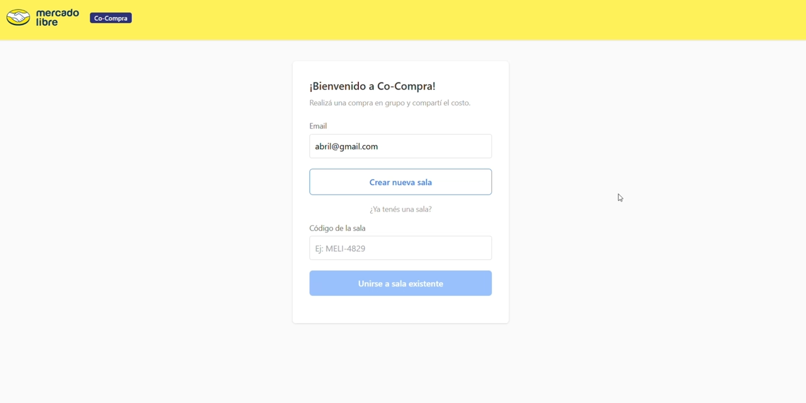
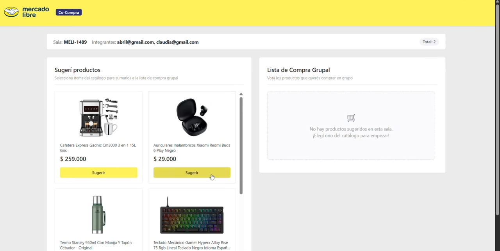
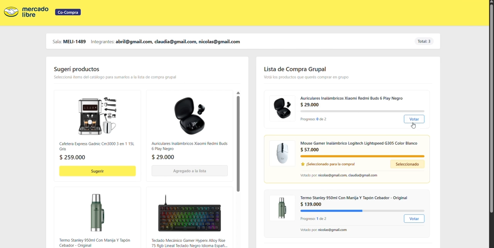
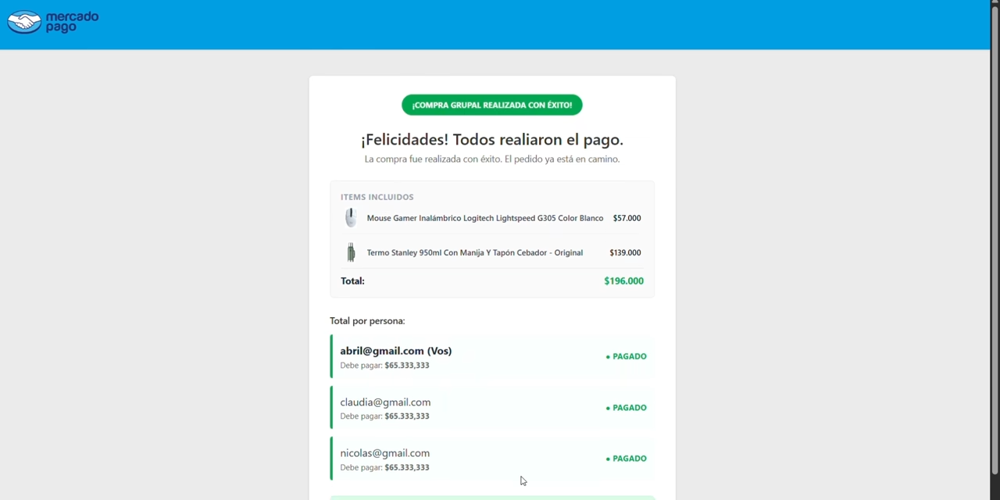
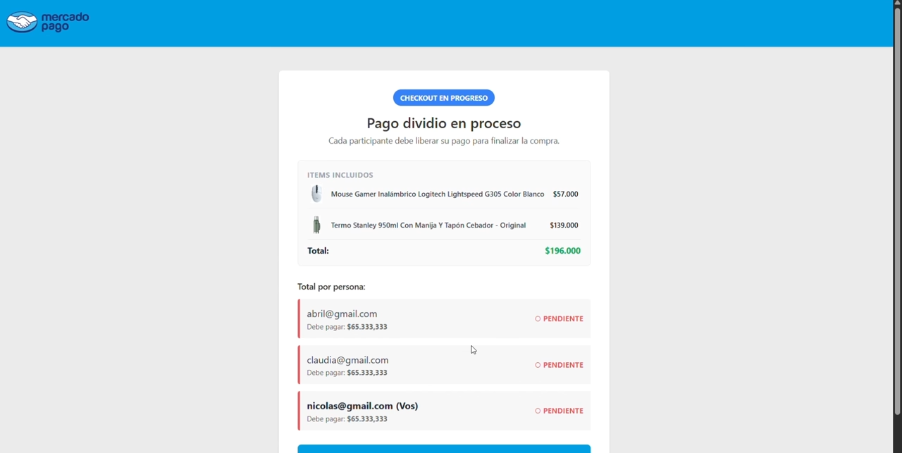

# Sistema de Compra Grupal en Tiempo Real

Un proyecto Full Stack desarrollado con la iniciativa de resolver un desafío clave: simplificar la experiencia del usuario al realizar compras compartidas y dividir gastos de forma equitativa en tiempo real.

### Imágenes del proyecto

  
  
  
  
  
  

### Tecnologías utilizadas
- **Backend:** Go (Golang)
- **Base de Datos:** Redis (Persistencia rápida en memoria)
- **Frontend:** React.js, TypeScript, Tailwind CSS
- **Protocolos & Arquitectura:** WebSockets (Comunicación bidireccional)

### Habilidades Aplicadas
- **Iniciativa & Proactividad:** Diseño y desarrollo completo de una arquitectura escalable inspirada en las reglas de negocio de Mercado Libre y Mercado Pago.
- **Enfoque Product-Driven:** Creación de una herramienta orientada a resolver casos de uso reales de la vida cotidiana (regalos grupales, gastos compartidos del hogar, compras de oficina o reuniones).
- **IA como Copiloto:** Incorporación de Inteligencia Artificial de forma estratégica para refactorizar algoritmos, optimizar la lógica y asegurar la limpieza del código.

### Funcionalidades principales
- **Votación:** Los participantes de la sala proponen productos del catálogo y votan en simultáneo con actualización inmediata.
- **Consenso:** El sistema valida que los productos tengan aprobación de la mayoría y que todos acepten pasar al checkout para avanzar.
- **Checkout:** División equitativa del costo total donde el sistema retiene la orden masiva y espera a que cada integrante libere su pago de forma individual para confirmar la compra con éxito.
